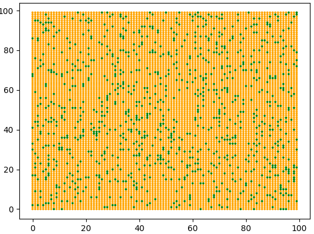
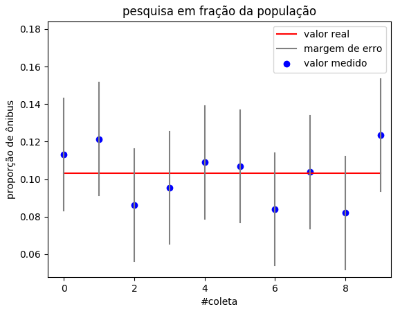
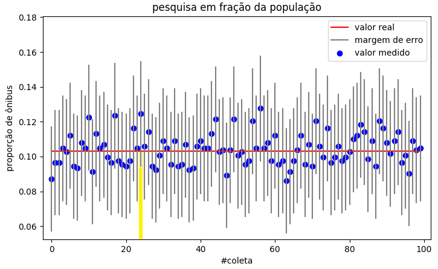

# SimulaPesquisa
Programa simples em Python para gerar uma amostra com ocorrência aleatória de uma característica, e simular uma pesquisa para descobrir a proporção dessa característica. 
Requisitos: 
- Roda em Python 2 e em Python 3.
- Para mostrar os gráficos, precisa da matplotlib (pip install Pillow).

## Exemplo:
O exemplo abaixo é o executado pelo programa em sua forma original.
Simulação de uma amostra de 10000 veículos comerciais onde aproximadamente 10% são ônibus. 

Segundo o site [sscalc](https://www.surveysystem.com/sscalc.htm), para obter 3% de margem de erro em 95% das pesquisas, é necessário fazer uma amostragem de 964 veículos.  
Simulando 10 coletas com 964 veículos cada, obtemos valores como os abaixo: 

 No eixo horizontal estão as coletas, no eixo vertical o resultado de cada coleta. Os pontos azuis representam a proporção medida de ônibus nas coletas e as barras cinza representam o intervalo de incerteza. A linha vermelha representa a proporção real de ônibus na população simulada.

  
Simulando 100 coletas com 964 veículos cada, obtemos valores como os abaixo. 

 A coleta 24, destacada em amarelo, representa um caso em que o valor real quase saiu fora da barra de incerteza.

